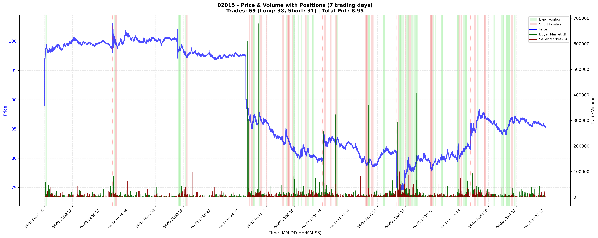
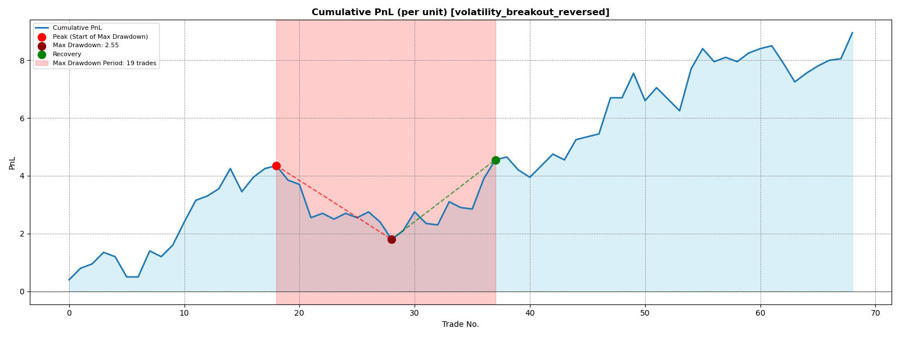
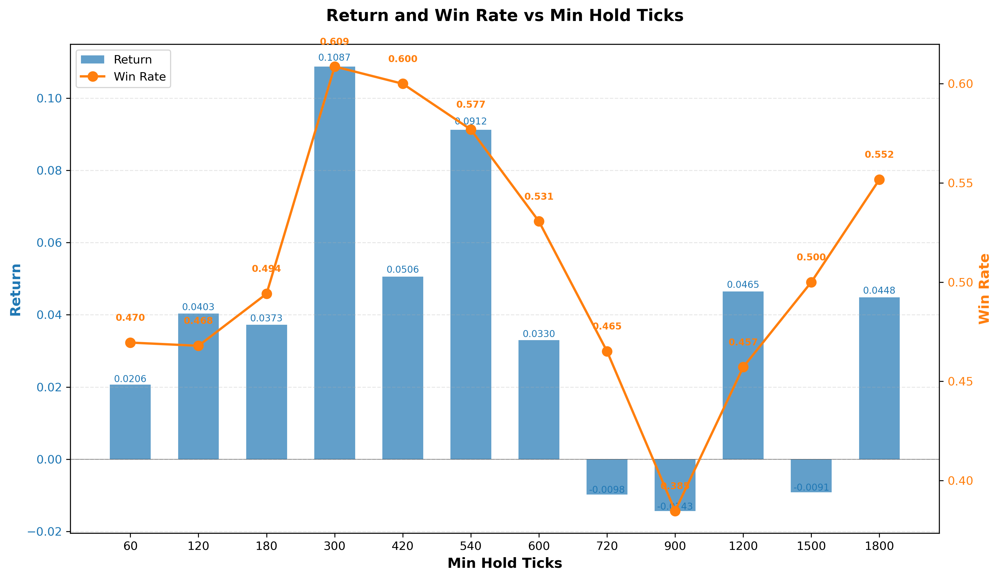
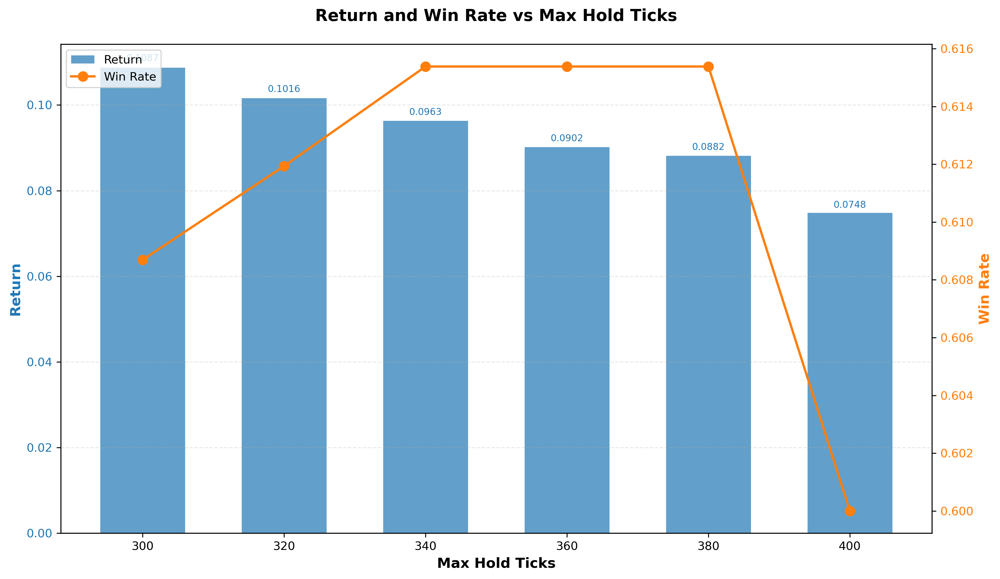
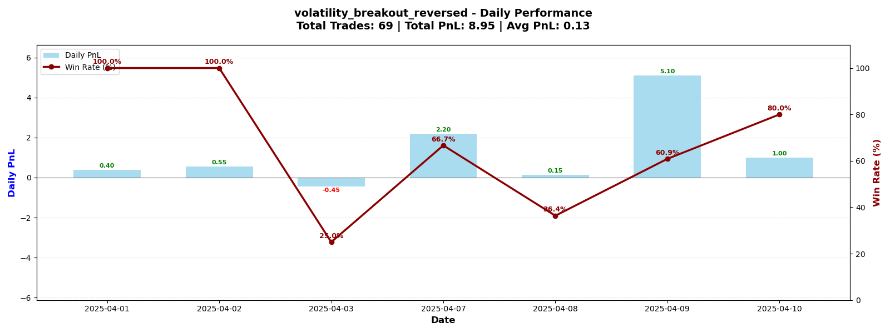
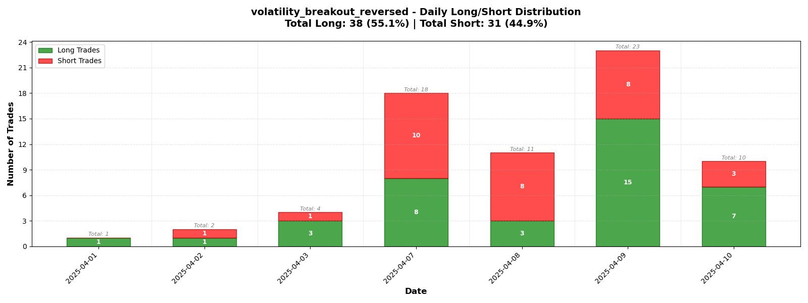

# High-frequency-trading-simple-framework
A lightweight HFT backtesting framework for order-book strategies. Trades at counterparty prices, ignoring slippage. Provides data preprocessing, feature engineering, strategy templates, and risk controls (rebalance limits, holding periods, stop-loss). Outputs performance metrics. Supports rapid strategy prototyping.

## main_batch.py<br>
Batch backtest for Hong Kong stock trading strategies, testing multiple strategies on 60+ stocks.<br>

*Core Functions*
* load_all_days_simple: Merge multi-day stock data
* process_stock_data: Process single stock (feature engineering)
* evaluate_stock_strategy: Evaluate single strategy performance (P&L, trade count, win rate)
* main: Main function, execute batch backtesting to 60+ HK stocks

*Data*
* Location: `F:\HKdata`subfolders
* Dates: 2025-04-01 to 2025-04-10 (7 trading days)
* Format: CSV Level 2 data

*Output*
* Console: Backtest progress and results
* summary.csv: Detailed records of profitable strategies<br>

<small>  
  
| stock | strategy | total_pnl | num_trades | win_rate |
|-------|----------|-----------|------------|----------|
| 00700.csv | orderflow_imbalance | 10.999999999999943 | 56 | 0.5 |
| 00700.csv | microprice_momentum | 25.0 | 16 | 0.625 |
| 00883.csv | volatility_breakout_reversed | 0.0199999999999995 | 3 | 0.6666666666666666 |
| 09985.csv | weighted_microprice_reversal | 7.9600000000000115 | 315 | 0.4380952380952381 |
| 01810.csv | trade_flow_imbalance | 1.5500000000000114 | 64 | 0.546875 |
| 01810.csv | microprice_depth_convergence | 0.5999999999999872 | 21 | 0.5714285714285714 |
| 00939.csv | microprice_momentum | 0.0199999999999995 | 1 | 1.0 |
| 02382.csv | trade_flow_imbalance | 3.550000000000012 | 40 | 0.6 |
</small>

## main_single.py<br>
Single-stock strategy testing script for Hong Kong stocks. Analyzes and visualizes trading strategy performance for a specific stock.<br>
Complete workflow: Data loading → processing → signals → backtesting → visualization

*Core Functions*
* load_all_days_simple(): Load multi-day stock data
* clean_price_anomalies(): Data cleaning
* plot_price_volume_combined(): Price-volume visualization
* add_l2_and_orderflow_features(): Add L2/order flow features
* add_low_frequency_features(): Add technical indicators
* add_rolling_volatility_features(): Add realized volatility and volatility regimes features
* generate_signals(): Generate trading signals
* filter_premarket_signals(): Filter pre-market trades
* backtest_cross_spread_with_log(): Backtest with detailed logging

Data
* Data source: `F:\HKdata`folders
* Trading days: 2025-04-01 to 2025-04-10 (7 days)
* Sample stock: 02015.csv(Li Auto-W)
* Strategy: volatility_breakout_reversed
  
*Key Parameters*
* stock: Stock filename (default: "02015.csv")
* signal_name: Strategy name (default: 'volatility_breakout_reversed')
* every_n_ticks: Plot frequency (default: 7200 ticks)
* figsize: Plot dimensions (default: 20×8 inches)

*Output*
* Console: Column info, processing logs
* Stats: Backtesting statistics dictionary
* CSV file: LOG.csv with trade details

<small>  

| trade_id | signal_name | direction | entry_time | entry_price | entry_type | exit_time | exit_price | exit_type | pnl | duration_seconds |
|----------|----------------------|-----------|---------------------|-------------|------------|---------------------|------------|-----------|-------------------|-------------------|
| 1 | volatility_breakout_reversed | long | 2025_04_01_09:30:22 | 98.8 | ask_open | 2025_04_01_09:35:24 | 99.2 | bid_close | 0.4000000000000057 | 302.0 |
| 2 | volatility_breakout_reversed | long | 2025_04_02_09:33:11 | 99.7 | ask_open | 2025_04_02_09:38:20 | 100.1 | bid_close | 0.3999999999999915 | 309.0 |
| 3 | volatility_breakout_reversed | short | 2025_04_02_09:39:35 | 99.7 | bid_open | 2025_04_02_09:44:38 | 99.55 | ask_close | 0.15000000000000568 | 303.0 |
| 4 | volatility_breakout_reversed | long | 2025_04_03_09:32:02 | 98.4 | ask_open | 2025_04_03_09:37:04 | 98.8 | bid_close | 0.3999999999999915 | 302.0 |
| 5 | volatility_breakout_reversed | long | 2025_04_03_09:37:05 | 98.85 | ask_open | 2025_04_03_09:42:08 | 98.7 | bid_close | -0.14999999999999147 | 303.0 |
| 6 | volatility_breakout_reversed | long | 2025_04_03_10:01:23 | 98.0 | ask_open | 2025_04_03_10:06:24 | 97.3 | bid_close | -0.7000000000000028 | 301.0 |
| 7 | volatility_breakout_reversed | short | 2025_04_03_10:06:25 | 97.3 | bid_open | 2025_04_03_10:11:25 | 97.3 | ask_close | 0.0 | 300.0 |
| 8 | volatility_breakout_reversed | short | 2025_04_07_09:37:14 | 87.5 | bid_open | 2025_04_07_09:42:14 | 86.6 | ask_close | 0.9000000000000057 | 300.0 |
</small>

* Plots: Price-volume signal chart + PnL chart<br>



### Experiment
By *evaluate_strategy_performance()* in *performance_analyse.py* we can control the variables to conduct various experiments.
```python
# 1. Run strategy and get trade log
trade_df = log.get_trade_log_df()

# 2. Evaluate performance
evaluation = evaluate_strategy_performance(trade_df, "experiment_name")
```
All results will be added into performance.csv.
<small>

| note | total_pnl | total_return | num_trades | win_rate | profit_factor | max_drawdown | trade_volatility | sharpe_ratio |
|------|-----------|--------------|------------|----------|---------------|--------------|------------------|--------------|
| min_hold_ticks_120 | 3.1000000000000085 | 0.04029787575690253 | 109 | 0.46788990825688076 | 1.201954397394137 | 0.043272680860713786 | 0.005224133311026535 | 0.07076873045966953 |
| min_hold_ticks_180 | 3.0500000000000256 | 0.037261906867053884 | 85 | 0.49411764705882355 | 1.2013201320132036 | 0.03828023128445701 | 0.007051364230761064 | 0.0621688740732092 |
| max_hold_ticks_380 | 7.099999999999909 | 0.08816875251131848 | 65 | 0.6153846153846154 | 1.6604651162790587 | 0.03363235059567249 | 0.006503298506814387 | 0.2085775925719307 |
| max_hold_ticks_400 | 6.099999999999909 | 0.07480561844210429 | 65 | 0.6000000000000000 | 1.5446428571428468 | 0.03363235059567249 | 0.006537084200939655 | 0.17605030514593026 |
| no_depth_imbalance | 3.7499999999998437 | 0.05557836442077555 | 91 | 0.5164835164835165 | 1.1820388349514483 | 0.061319544268891746 | 0.008358014332653261 | 0.07307372697185556 |
| no_relative_spread | 3.7999999999999687 | 0.048611512119586836 | 104 | 0.5769230769230769 | 1.1909547738693447 | 0.052044578630978444 | 0.006346731486768221 | 0.07364710272362085 |
| no_signed_vol | 10.499999999999943 | 0.13821785472121934 | 86 | 0.5581395348837209 | 1.638297872340422 | 0.04171771855104134 | 0.007831331546971776 | 0.20522491578650476 |
| no_price_change | -4.100000000000051 | -0.02530664727684087 | 293 | 0.49146757679180886 | 0.93160967472894 | 0.15658076143887278 | 0.008122132279080445 | -0.010634006791668269 |
</small>

**Ablation Study -- PnL contribution**
<small>

| Configuration | Total_PnL | PnL_Change | Key_Finding |
|--------------|-----------|------------|-------------|
| Full_Strategy | 8.95 | — | Baseline performance (best overall) |
| Remove_σₜₒw Filter | -2.15 | -11.10 | **Highest contribution**: Essential for filtering noisy signals, turns strategy profitable |
| Remove_ΔP₃ | -4.10 | -13.05 | **Second highest contribution**: Critical for mean-reversion timing |
| Remove_Imb_depth | 3.75 | -5.20 | Important L2 feature, contributes significantly to performance |
| Remove_Spread_rel | 3.80 | -5.15 | Important L2 feature, works synergistically with other features |
| Remove_V_signed | 10.50 | +1.55 | **Risk control feature**: Increases returns but also increases max drawdown |
</small>

**Sensitivity Test -- Denoising: Minimum holding period**

**Controlled Test -- Risk Management: Maximum holding period**

<table>
  <tr>
    <td></td>
    <td></td>
  </tr>
  <tr>
    <td align="center"><strong>Min Hold Ticks Analysis</strong></td>
    <td align="center"><strong>Max Hold Ticks Analysis</strong></td>
  </tr>
</table>


## single_stock_no_strategy.py<br>
Core trading system module. Handles data processing, feature engineering, and backtesting without​ specific trading strategies.

*Core Functions*
* load_l2_ticks()​ - Load and parse CSV data
* add_l2_and_orderflow_features()​ - Add 100+ OB features<br>
* add_low_frequency_features()​ - Add minute-level features<br>
* add_rolling_volatility_features()​ - Add volatility metrics<br>
* generate_signals()​ - Process raw signals into positions
* backtest_cross_spread()​ - Execute trading strategy
* backtest_cross_spread_with_log()​ - Backtest with logging
* filter_premarket_signals()​ - Remove 9:00-9:30 signals

*Feature Engineering*
<small>  

| Category | Feature | Description |
|---|---|---|
| **OB Features** | Order Flow | Order flow imbalance (OFI), signed volume |
|  | Depth Imbalance | Bid/ask depth difference |
|  | Spreads | Bid-ask spread, relative spread |
| **LF Features** | Bollinger Bands | Price position within bands |
|  | RSI | 1-minute RSI for overbought/oversold |
|  | Channel Position | Price position in high-low channels |
| **Vol Features** | Realized Volatility | Rolling volatility (30s, 1min, 5min) |
|  | Volatility Regimes | Volatility percentile, high/low vol states |
</small>

*Trade Loggers*
* TradeLogger​ class: Record all trade details
* Outputs: Entry/exit time, price, P&L, duration
* Saves to: trade_log_[strategy].csv

## single_trade_strategy.py<br>
Trading strategy definitions module. Contains 5+ signal generators that produce trading signals.

*Core Functions*
* Signal generators: 5 trading strategies by OB, LF, and volatility features (e.g., signal_orderflow_imbalance())
* Risk controls: Max hold time, stop-loss logic (_add_max_hold_time(), _add_stop_loss())
* Cooldown: Prevent rapid direction flips
* Signal registry: Central registry for all strategies  (SIGNAL_REGISTRY, calculate_signal())

*Available Strategies*
<small>  

| Strategy Name | Description |
|---|---|
| orderflow_imbalance | Fade extreme OFI with low-frequency confirmation |
| microprice_momentum | Simple microprice momentum |
| depth_spread_arb | Bollinger Band depth-spread arbitrage |
| volatility_breakout_reversed | Reversed volatility breakout |
| signal_diagnostic_test | Diagnostic test strategy |
</small>

## performance_analyse.py<br>
Performance analysis and visualization module. Generates charts and metrics for trading strategy evaluation.
*Core Functions*
* plot_price_chart()​ - Basic price chart
* plot_price_volume_combined()​ - Price + volume + positions
* evaluate_strategy_performance()​ - Calculate key metrics (e.g., Returns, drawdown, Sharpe ratio) and save results by save_to_performance_csv()
* plot_combined_performance_MaxHolding()​ - Analyze max hold effects
* plot_combined_performance_MinHolding()​ - Analyze min hold effects
* plot_daily_trade_analysis()​ - Daily P&L and win rate



